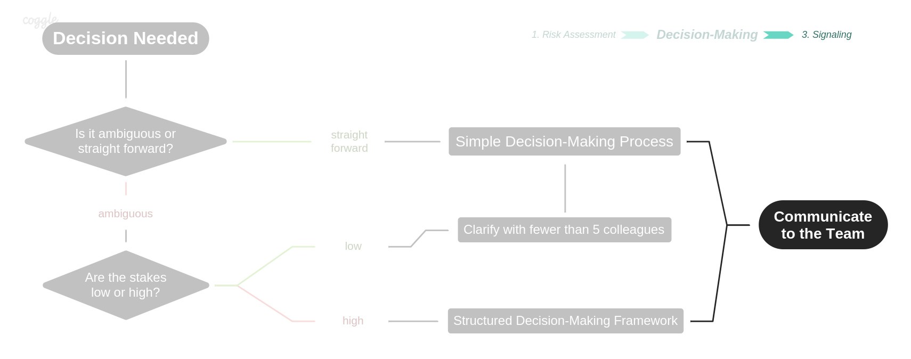

# Signaling


After [assessing](risk-assessment.md) and [deciding](./), it is time to make sure we reduce information asymmetry and  signal some of the: **rationale**, the actual **decision** and it's **implications** \(be it with simple bread-crumbs or a proposal document\).


Helping colleagues understand what is going on and what is coming to be nurture **synergies** and **stigmergy**. And those are special ingredients to beautiful things.

## KISS \(Keep It Small and Simple[\*](https://www.interaction-design.org/literature/topics/keep-it-simple-stupid)\)

### Simple Decisions

As mention earlier, small decisions ideally fit inside kanban cards. "Sharing is caring" here simply means keeping the card minimally updated. If a decision didn't change a card or wasn't mentioned on Discord \(directly by the decision maker or delegated to someone else\) then either it is too small \(e.g. only affects the decision maker\) or it simply isn't complete.

### Structured Decisions

#### Consent based 

Will usually happen during calls and thus should be logged in a [call tactical](../resources/taticals/) and then to the "[Roles & Policies](https://dao-incubator.gitbook.io/wiki/org/governance)" doc. If outside of a call, please make sure to streamline it to its housing. By either DIY or asking the comms circle's help.

#### Consensus based

Decisions made in Arenas like Loomio, Aragon and others have automated ways of storing decisions outputs - as long as proposals are pictured in a clear and helpful way. Eventually they too move to our "Roles and Policies" doc.

As described in [this proposal](https://docs.google.com/document/d/11QyCfUZVveBDw2Mib8jFKiM-mBZHNbNAbaBve5EylGY/edit?usp=sharing): "Expectations not set in [Roles & Policies](https://dao-incubator.gitbook.io/wiki/org/governance) doc are not valid."

> "If we can’t report well, we don’t pursue."   
> @nonprofitbecky

## **Communication is critical to the process.**

> A decision is not complete until all impacted by that decision are notified. if you'd never abandon a puppy, why abandon decisions outputs? Think about the puppies.

The decision-maker is accountable for determining the best format to deliver this communication. For example, if everybody is highly impacted, an direct message to all team mates may be the best way to communicate the decision. If nobody is directly impacted today, an FYI in a Discord channel and a note in a card may be sufficient.

## Where?

As we come together and build together we know that:

* **Decisions** have [Arenas](signaling.md#arenas)
* **Communications** have [Channels](signaling.md#channels)
* and **Artifacts** & **Assets** have [Environments](signaling.md#environments)

### Arenas

| Simple | Consent | Consensus |
| :--- | :--- | :--- |
| Trello | Calls | Loomio |
| Discord | Discord | Aragon |



* Tacticals



* Cards
* Labels
* Columns







Threads

* Proposal
* Check
* Poll
* Dot
* Score
* Time Poll
* Ranked Choice







### Channels

| \*\*\*\* | **General** | **Technical** |
| :--- | :--- | :--- |
| **Sync** | Telegram | Calls |
| **Async** | Discord, Twitter | Trello, GDocs |

* Telegram
  * ~~Core group~~
  * WG group - _Internal light chatter_ 
  * Public channel - _"An open place for everything about DAOincubator, DAOs and incubation"_
  * Ad Hoc
* Discord
  * Core; WP - _General internal channels_
  * General; Random - _Public Channels_
  * Circles; Projects; Protocols - _Very specific channels_
* Twitter - _Community announcements_ 
* Calls
  * Core 
  * WG
  * Ad hoc

**Examples:**

* General-Sync: [NuCypher Telegram](https://t.me/nucypher)
* General-Async: [r/Bitcoin](https://www.reddit.com/r/Bitcoin/)
* Technical-Sync: [Decred Slack](https://slack.decred.org/)
* Technical-Async: [Ethresearch](https://ethresear.ch/)

### Environments

An **environment** or **tier** is a system in which a process or component is deployed and accessible. In simple cases there may be a single environment, but in uses at scale the development environment \(where changes are originally made\) and production environment \(what end users use\) are separated; often with several stages in between. This structured release management process allows phased deployment \(rollout\), testing, and rollback in case of problems.

These normally break down as follows:

#### **Development**: 

[_GDrive folder_](https://drive.google.com/drive/folders/11Dcr_kgeR_lPenmb1hdT72rbYvVMrqX7)_, mostly_  
Working In Progress, new documents, drafts, sketches are deployed here so collaboration and feedback may happen. This environment is rapidly updated and contains the most recent version of our work.

#### **Staging**:

_You are here_  
This is the release candidate, and this environment is normally a mirror of the production environment. The staging area contains the "stable" versions and pre approved documentation and is used for final stress testing and voting/approvals before going live.

#### **Production**: 

_Our_ [_public gitbook_](https://dao-incubator.gitbook.io/)  
This is the currently released version of our work, accessible to the community/end users. This version preferably does not change except for during scheduled releases.

## Conclusion

**Decisions** emerge from **discussions** and eventually produce **Artifacts**, to be used as **Assets** on future cycles of communications and decisions all over again. Such cycles can 

Environments can 

