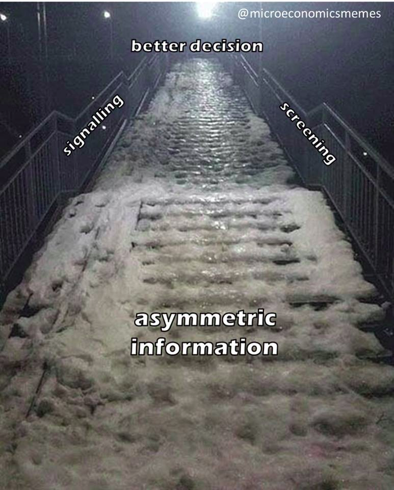

# Signaling

## Where?

* **Decisions** have [Arenas](signaling.md#arenas)
* **Communications** have [Channels](signaling.md#channels)
* and **Artifacts** & **Assets** have [Environments](signaling.md#environments)

### Arenas


TBD


**Proposal**: At our current scale all decisions should happen during calls or on Loomio.  
As we scale, eventually a migration to web3 tools like Aragon and Alchemy.

### Channels

### Environments

An **environment** or **tier** is a system in which a process or component is deployed and accessible. In simple cases there may be a single environment, but in uses at scale the development environment \(where changes are originally made\) and production environment \(what end users use\) are separated; often with several stages in between. This structured release management process allows phased deployment \(rollout\), testing, and rollback in case of problems.

These normally break down as follows:

#### **Development**: 

[_GDrive folder_](https://drive.google.com/drive/folders/11Dcr_kgeR_lPenmb1hdT72rbYvVMrqX7)_, mostly._  
Working In Progress, new documents, drafts, sketches are deployed here so collaboration and feedback may happen. This environment is rapidly updated and contains the most recent version of our work.

#### **Staging**:

_This is here._  
This is the release candidate, and this environment is normally a mirror of the production environment. The staging area contains the "stable" versions and pre approved documentation and is used for final stress testing and voting/approvals before going live.

#### **Production**: 

_Our_ [_public gitbook_](https://dao-incubator.gitbook.io/)_._  
This is the currently released version of our work, accessible to the community/end users. This version preferably does not change except for during scheduled releases.

## Signaling and screening games

