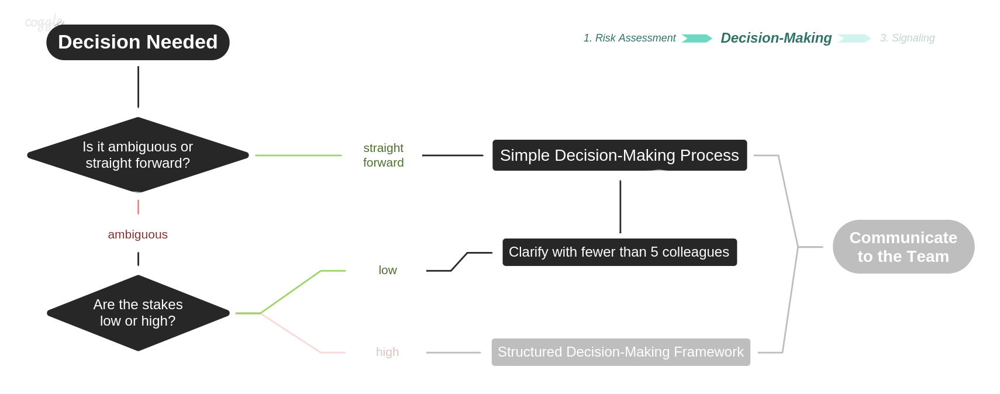

# Simple Decision-Making Process


After proper [assessment](risk-assessment.md), if a decision is 1\) **straightforward** and **low stakes**; ****OR 2\) **ambiguous** but clarifiable with less than 5 colleagues; then just make the decision - and make sure you [signal](signaling.md) it afterwards.


A **Simple Decision-Making Process** prioritizes execution over deliberation. Empowering teams to execute comes with the risk of making more mistakes.

* First, we shall establish a [**simple decision-making process**](simple-decision-making-process.md#kiss-keep-it-small-and-simple). 
* From which we [**engineer the memes**](../resources/memes.md) for a culture where teams does not second guess such decisions. 
* And underlying it all, we nurture a shared sense of [**values**](https://dao-incubator.gitbook.io/wiki/) that guide decisions. 

May this process provide guidance on how avoid unnecessary costs in low-stakes decisions and prioritize execution on all decisions.

## KISS \(Keep It Small and Simple[\*](https://www.interaction-design.org/literature/topics/keep-it-simple-stupid)\)

If a decision is both small & simple / straightforward & low stakes then it should be anchored to an clear actionable. If not all, most actionables should be listed on our [kanban board](https://trello.com/b/XrAjqdlO/dao-incubator). Thus be most reliable rule of thumb for simple decision making is:

1. Find/create a card 
2. Change the card
3. Validate with peers
4. Have fun, drink water

 Otherwise it is suggested:

* Clearly delegate the actual trello card interaction to someone else
* If absolutely incompatible with kanban/trello, just write something on Discord

