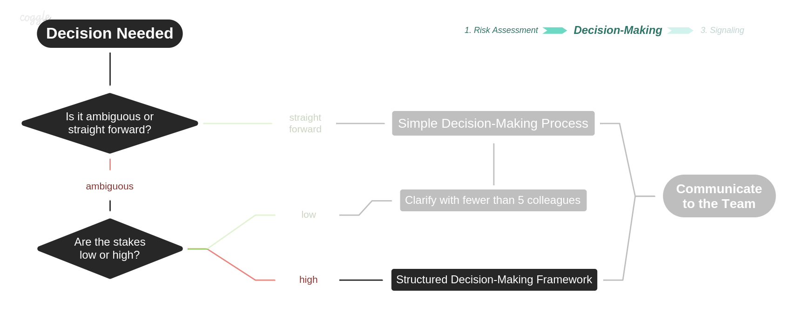

# Structured Decision-Making Framework

Is only needed when there is lack of clarity about a decision that is _higher risk_. Higher risk can mean that the decision has long term implications or that it can be costly to unwind if the wrong decision is made.[\*]()

Structure removes ambiguity around process and should lead to better decisions with lower overhead. The framework has three stages: **\(1\)** setting the parameters, **\(2\)** deliberation, and **\(3\)** decision.

1. **Setting the parameters** is about describing what decision we’re making, who needs to make the decision, who is impacted, and when the decision needs to be made. [Proposal building](../resources/template.md)
2. **Deliberation** is voting on the options. [Loomio](https://www.loomio.org/g/X5fYj0u1/daoincubator)
3. **Decision** documents the decision made, the rationale for the decision, and the plan to communicate the decision back to those impacted. _You are here_, this is literally what this proposal is about.

#### 1. Set the parameters 

In this step you’ll get everyone on the same page about how the decision will be made. It helps to do this up front to get buy-in and minimize second guessing down the road.

You’ll notice a few pieces here:

* **The decision date** Choose a deadline in advance to help avoid analysis paralysis \(waiting too long for more information to arrive\). It also gives surety to any parties who are blocked waiting for this decision to be made.
* **The revisit date** Ask the group to agree in advance how long they will commit to this decision. This helps avoid revisiting the decision prematurely. No decision is set in stone, you just want a clear agreement about how and when it will be revisited. The decision maker also has the right to push the “emergency button” in the event a decision is going wrong, to revisit it sooner.

There are three types of people involved in any decision.

* **Decision maker\(s\)** — those making the decision.
* **Input providers** — those influencing the decision.
* **Affected parties** — those affected by the decision.

The ideal number of input providers is between three and eight people. There are diminishing returns to group discussions beyond this point. And the decision may affect a much wider group \(the affected parties\), so try to have each affected party represented by at least one input provider.

Finally, there are three types of decisions:

* **Binary** — yes/no decision such as onboarding someone or buying an asset.
* **Prioritization** — force rank a number of options, such as choosing the next five features to build out of one hundred possible options.
* **Choice** — choosing a single option among many possibilities, such as a name for a new product.

> “A good plan, violently executed now, is better than a perfect plan next week.”  
> - Gen. George S. Patton

**Should there be one decision maker or multiple?**

For most decisions, I like to choose one decision maker to keep it simple. However, it can make sense to have multiple decision makers for high risk decisions \(where the cost of an _incorrect yes_ decision is greater than the cost of an _incorrect no_ decision\).

In the same way a bank might require multiple approvals to move a large amount of money, you can put “controls” around high-risk decisions by adding more decision makers, and giving each a veto right. This means a yes decision can only happen if every decision maker is a yes.

If you go all the way to requiring a unanimous yes from each input provider, it will further minimize downside potential, but cap your upside as well \(“design by committee”\). Yes decisions in some areas \(e.g. venture capital\) can look like contrarian bets that a large panel of people would be unlikely to agree on, so it can be dangerous to move too far toward safety.

Balance these trade offs to find the right number of deciders for your particular decision.

In general, if the cost of a wrong decision is tolerable \(low stakes\), choose a single decision maker to capture the speed bonus. If a wrong decision would be irreversible or too costly, add more decision makers.

#### 2. Deliberate 

Next you’ll need to get all the input providers \(and decision makers\) in a room to share information, and capture their votes.Sample deliberation step where you capture votes, and pros/cons of each option.

* **Enumerate the options** Do a mini brainstorm here of options. Go for quantity first, and defer judgement. Get everyone to think creatively. Once you’re done, see if you can consolidate any of the options which are duplicates. Note: you can skip this if you’re making a binary decision because you already know the options: yes and no.
* **Present data** If there is any data gathered from customers, split tests, the legal team, outside consultants, etc, now is the time to present it the group. Ideally these are shared as pre-reads in advance of the meeting to deliberate.
* **Voting round one \(blind\)** Capture the first round of votes \(from input providers\) to take the temperature of the room, ideally without anyone seeing others votes in advance. For a _binary_ decision, have everyone do thumbs up or down on the count of three in the room. For a _prioritization_ or _choice_ decision, have everyone assign votes in a spreadsheet \(encourage them not to look at the other columns\).
* **Discussion of Pros and Cons** Go around the room, from least senior person to most, and have everyone share why they voted the way they did. Allow a freeform but timeboxed discussion to follow. Capture the pros and cons discussed in the notes field of each option. Encourage everyone to speak up, get curious, and learn something new. You will frequently find at this stage that there are shades of grey between the options you enumerated, and no clearly “best” option. You can continue updating the list, adding or consolidating options.
* **Voting round two** Finally, after each input provider has heard what the others think \(fully connected information sharing\) ask for a second round of voting, and see if anyone’s votes have changed. Capture the second round of votes in the spreadsheet for record keeping.

Occasionally you will have clear consensus in the room at this step, and the decision maker’s job is easy. They can simply communicate their decision and the process is complete. But more often, the decision maker\(s\) will move on to the final step.

If necessary, you can complete additional rounds of discussion and voting, within the constraints of the decision date.

#### 3. Decide 

Memorialize the decision for later view.

* **Make the decision** The decision maker\(s\) can now take a day or two to deliberate on the input, and make a final call. Even if there is no clear “best” option, they will still need to decide by the decision date.
* **Communicate it** Email the decision out to all those who are affected by it. Include a list of input providers, options considered, a brief rationale \(pros and cons\), and the revisit date. You don’t need to include who voted which way, since you are all moving forward as one unified team at this point.
* **Memorialize the decision** Finally, save the spreadsheet in a permanent place \(like Google Docs\) where it can be reviewed at a later date. You may want to schedule a reminder on the revisit date to pull the input providers back together as a learning exercise. These can be fun to review how wrong decisions got made \(post mortems\) and to guard against history revisionists \(I knew it wouldn’t work!\).

If the decision was contentious, delivering it via email will give people time to process asynchronously, instead of getting their first reactions live in the room.

#### Conclusion 

Difficult decisions can be a source of stress in many organizations, but they don’t have to be. In high performing organizations, they are opportunities to make rapid progress, innovate, and win.

There are many ways to mess up decision making, and just like anything you will get better at it over time. I’ve compiled a list of failure modes below and tried to give them a memorable name:

* **Lots of chatter** A bunch of one-off conversations happen instead of getting all input providers in a room to share knowledge together \(fully connected information sharing\).
* **Lord of the flies** No clear decision maker chosen until after battle lines have been drawn.
* **Last minute addition** Realizing that someone should have been an input provider late in the process, and trying to sneak them in.
* **Conflict of interest** A biased decision maker is chosen instead of a neutral one.
* **In the weeds** A manager chooses them self as the decision maker when it could have been delegated to someone on their team.
* **Pulling rank** A manager chooses someone else as the decision maker, then overrules them at the last minute! \(you have to genuinely be ok with whatever the decision maker decides if you’re going to delegate\)
* **Yes people** Letting the most senior/privileged voices in the room sway a conversation, before hearing what others think.
* **Accidental yes** The discussion happens over email \(generating momentum of +1s\), one-off conversations, or a rushed meeting with busy people. There appears to be consensus, but the input providers haven’t given the decision due consideration.
* **Analysis paralysis** The decision is delayed past the decision date in the hopes of receiving more data. \(“Let’s split test it!” can be a form of this if taken too far.\)
* **Creativity killer** Failing to separate enumeration of options from evaluation of options.
* **Tearing off the bandaid** Letting “there are no good options!” prevent you from choosing the “least bad” option.
* **Too much process** Using the decision making process on a low-risk decision when the manager could have unilaterally, and more quickly, made it in the moment.
* **Unintentional democracy** The decision maker feels pressured to choose the option with the most votes, abdicating their responsibility to choose what they feel is really the best option.

This framework has helped Coinbase make better decisions, faster, with more buy in. Hopefully you find it useful on your team!  

If the decision is both ambiguous and high-stakes, we use the framework. If the decision is only ambiguous, the decision-maker can collaborate with a few people and make the call. And if the decision is neither ambiguous or high-stakes, the decision-maker should simply move forward. In all cases, communication to the team completes the decision.

